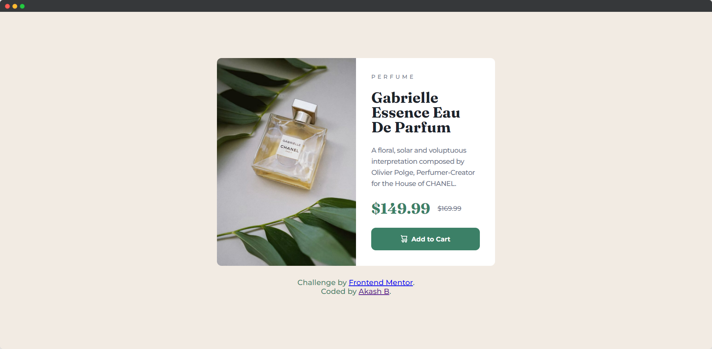

# Product preview card component solution

This is a solution to the [Product preview card component challenge on Frontend Mentor](https://www.frontendmentor.io/challenges/product-preview-card-component-GO7UmttRfa).

## Table of contents

- [Product preview card component solution](#product-preview-card-component-solution)
  - [Table of contents](#table-of-contents)
    - [The challenge](#the-challenge)
    - [Screenshot](#screenshot)
    - [Links](#links)
    - [Built with](#built-with)
  - [Author](#author)

### The challenge

Users should be able to:

- View the optimal layout depending on their device's screen size
- See hover and focus states for interactive elements

### Screenshot

### Links

- [Solution URL](https://your-solution-url.com)
- [Live Site URL](https://your-live-site-url.com)

### Built with

- Semantic HTML5 markup
- CSS custom properties

## Author

- Website - [Akash B.](https://akashbanchhor.netlify.app)
- Frontend Mentor - [@akash02ab](https://www.frontendmentor.io/profile/akash02ab)